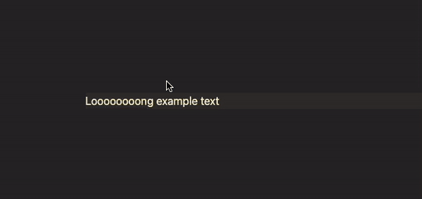

# It is so raw plugin
# Obsidian Wrap Text

This is a plugin for wrapping text in HTML tags with a class.
I create this plugin because I don't find any analogues.
The standard Obsidian selections are not enough for me, and I don't really like writing  every time.

## Settings
### Emmet Format

With emmet format you can write tag.class.class etc.
Without emmet format you write tag and class in two input.

### Prefix

With a prefix, all your classes will have your prefix

## Commands

Wrap selected text - Wrap selected text in tags and classes
<small> I use cmd+ option + w shortcut</small>

Unwrap selected text - Remove wrap
<small> I use cmd+ ctrl + w shortcut</small>

